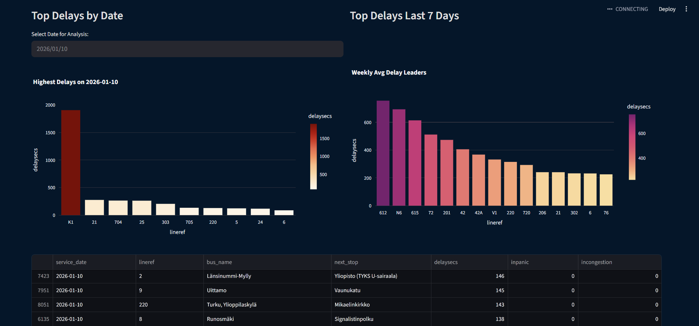
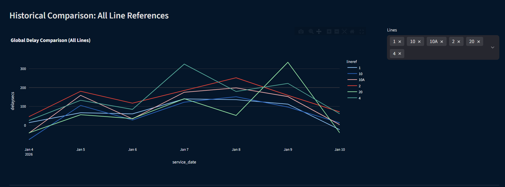
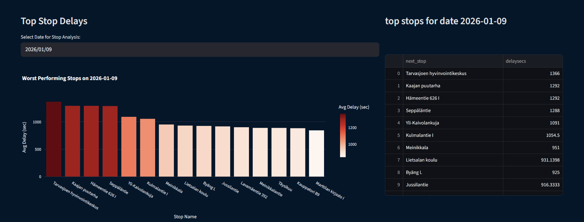

# FOLI Bus Delay Monitor (Airflow + Postgres + Streamlit)

This project pulls real-time bus operation data from the **FOLI Service Public API**, polls it every 3 minutes using Apache Airflow, transforms/cleans it, and stores it in a local PostgreSQL database.  
A Streamlit app (`dashboard.py`) then reads from Postgres to visualize delays, trends, stops, and status insights.

---

## What the Dashboard Shows
### 1) Delay (seconds) by Bus Number + Bus Name (Line Graph)
- Line chart of **DelaySecs** grouped by **BusNo + BusName**.
- Because a **BusName + LineRef** can appear multiple times, we plot the **average DelaySecs** for clean trend lines.
- Helps spot which buses are consistently running behind.


---

### 2) Late Lines by Date + Weekly Delays + Raw Sorted Table
- **Bar chart by selected date**: shows **which line(s)** were late on that date.
- **Weekly bar chart (last 7 days)**: DelaySecs trend across the past week for the selected date range.
- Includes a **raw table sorted by DelaySecs** so you can quickly find the worst offenders.



---

### 3) Historical Comparison (Multiple Buses)
- Historical view of delays across time.
- Pick **multiple buses** via a multiselect filter to compare trends side-by-side.



---

### 4) Delay Hotspots by Stop (Per Date)
- For a chosen date, identifies **which stops accumulate the most DelaySecs**.
- Includes:
  - A **bar chart** of the top delay-heavy stops
  - A **raw table** for full detail



---
### 5) Congestion + Panic Indicators (Quick Status Info)
- Displays operational signals from the API related to buses in **congestion** and **panic** states.
- Useful for fast situational awareness beyond just lateness.


## ETL + Airflow (How Data Moves)

**Flow:**  
`FOLI Public API → Airflow DAG (every 3 minutes) → Transform → Postgres (localhost) → Streamlit Dashboard`

- The Airflow DAG lives in: `dags/foli_ETL.py`
- It:
  1. **Extracts** fresh API data on a 3-minute schedule  
  2. **Transforms** it (normalizes fields, computes useful columns like averages where needed)  
  3. **Loads** it into **PostgreSQL** running locally  
- Logs are written under `logs/` for easy debugging.

---

## Project Structure

``` text
.
├─ dags/
│  └─ foli_ETL.py              # Airflow DAG: poll API, transform, load into Postgres
├─ dashboard.py                # Streamlit app: charts + tables from Postgres
├─ docker-compose.yaml         # Local services (typically Postgres / Airflow stack)
├─ requirements.txt            # Python dependencies
└─ logs/                       # Run logs